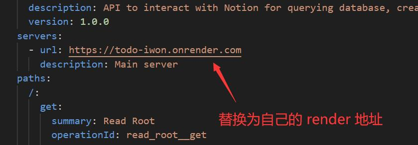
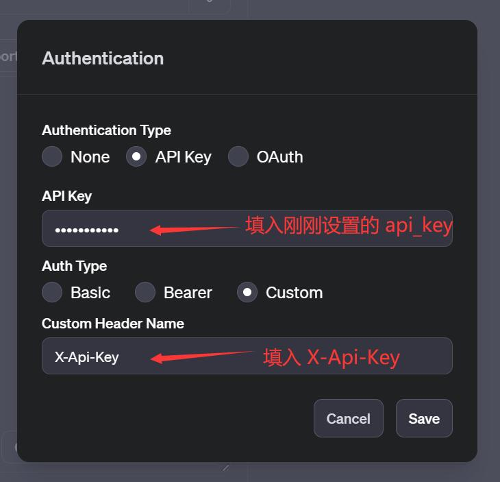

## 配置 Notion

使用 Notion API 需要先创建自己的集成。然后获取访问凭证来调用 API

### 步骤一：创建集成

1. 登陆 Notion 开发者后台 [My integrations | Notion Developers](https://www.notion.so/my-integrations)

2. 在 我的集成 页面，单击 **创建新的集成**，填写集成名称，然后单击 **创建**。

   

      
   

3. 提交后就能看到我们需要的 **Token** 了，将它们保存下来，我们之后会用到

   

      
   

### 步骤二：配置 Notion 数据库模板

1. 点击 Notion 链接：https://talented-petunia-553.notion.site/To-Do-List-90a81314b090445b8ba8dfd0dc8def2d?pvs=4。获取 To-Do List 模板

3. 安装我们在**步骤一**创建好的集成

   点击**右上角的三个小圆点**→点击弹出菜单中的 **Add connections** →点击**添加 To-Do Master**
   
   

      
   

   
   
   

## 部署API

1. 点击 [链接](https://github.com/Reborn14/To-Do-Master/fork)，fork 本项目

2. 注册并登陆 [Render](https://render.com/)，推荐使用 GitHub 登陆

   > Render 是一个国外的云服务提供商，它提供了一系列托管服务，包括静态站点、Web应用程序和无服务器功能。

   

      
   

3. 点击链接创建 [New Web Service (render.com)](https://dashboard.render.com/create?type=web)

4. 选择连接 **To-Do Master**

   

      
   

5. 填写**名称**和**启动命令**，并选择**免费**项目

   启动命令：`uvicorn main:app --host 0.0.0.0 --port 10000`

   

      
   

   
   

      
   

6. 设置环境变量

| 键(Key)        | 值(Value)                        |
| -------------- | -------------------------------- |
| API_SECRET_KEY | 自己设置一个`api_secret_key`     |
| NOTION_TOKEN   | 填入刚刚创建集成的`notion_token` |
| DATABASE_ID    | 填入自己数据库的`database_id`    |

   

      
   

   > 如何提取 Notion 数据库的 `DATABASE_ID` ?
   >
   > 举例：https://www.notion.so/56c8f3b9c1474afc9f09c91e80bf667a?v=09d3b4c205384b3a94517b7b871bce47
   >
   > `DATABASE_ID` =  56c8f3b9c1474afc9f09c91e80bf667a

7. 点击创建

## 创建GPTs

1. 点击 [链接](https://github.com/Reborn14/To-Do-Master/blob/main/prompt.md)，复制 prompt

   - 替换 prompt 中的 `url` 地址为自己的 Notion 数据库
     
   

      
   

2. 点击 [链接](https://github.com/Reborn14/To-Do-Master/blob/main/how-to-query.json)，下载 **knowledge** 文件

3. 点击 [链接](https://github.com/Reborn14/To-Do-Master/blob/main/openapi.yaml)， 复制 `OpenAPI schema`

   1. 替换 `url`为自己部署的 `render 地址`

   

      
   

   2. 设置 `Authentication` ,填入刚刚设置的 `API_SECRET_KEY`

   

      
   

4. 完成 GPTs 的创建

