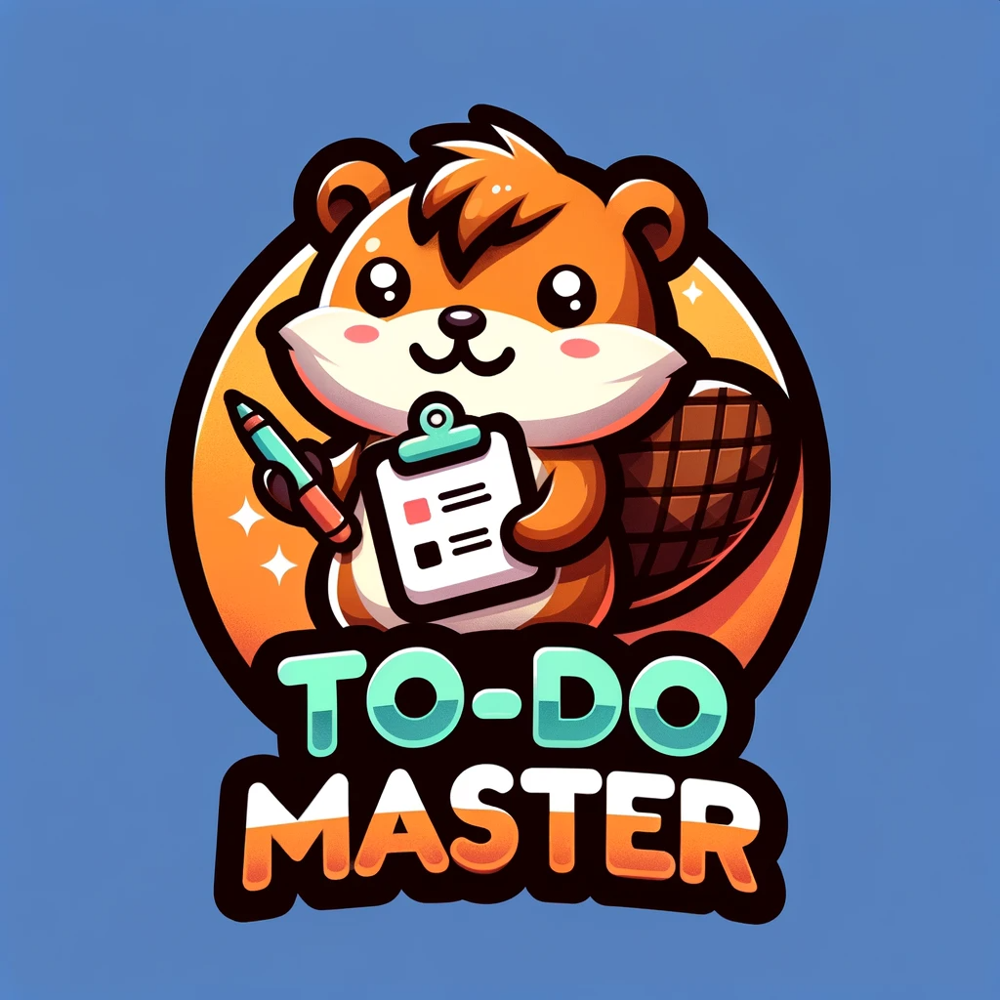
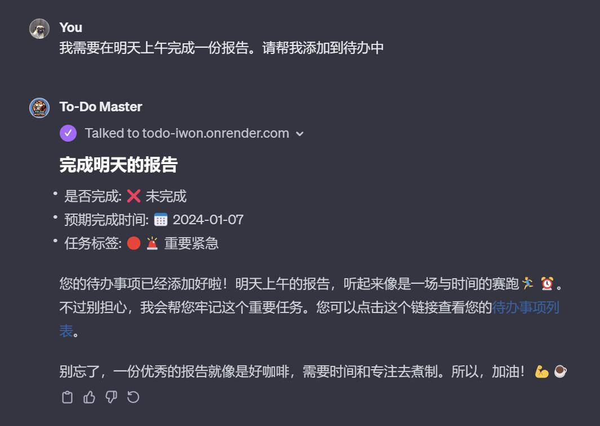
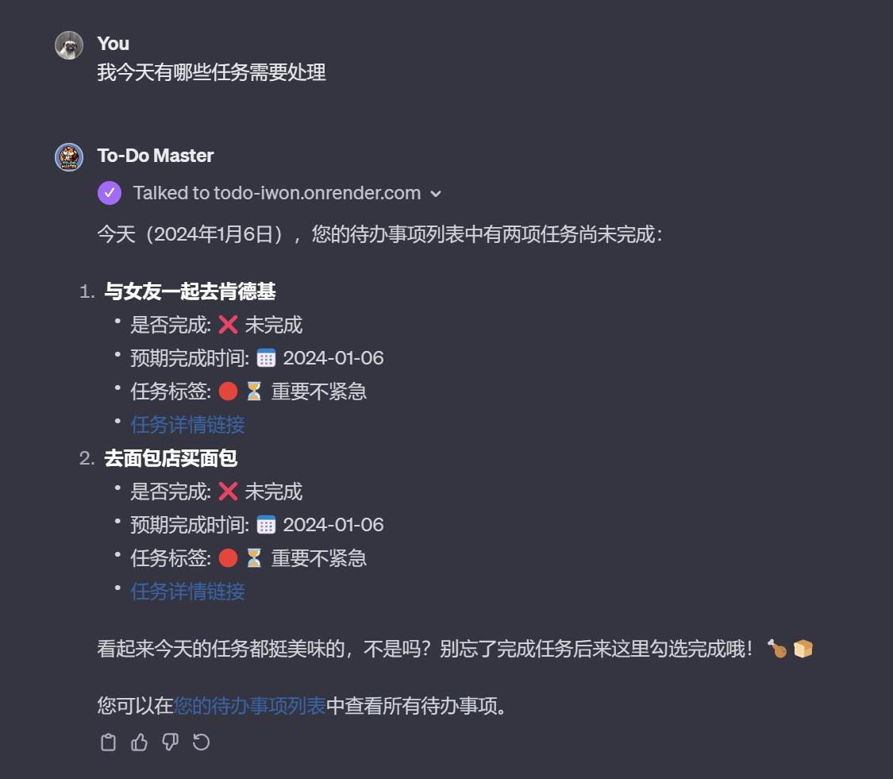
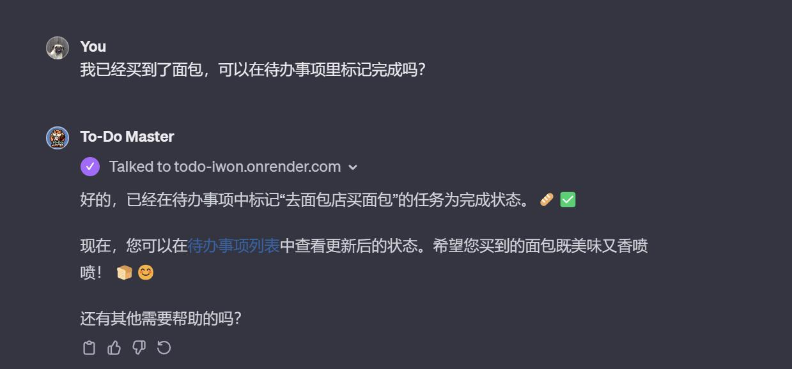
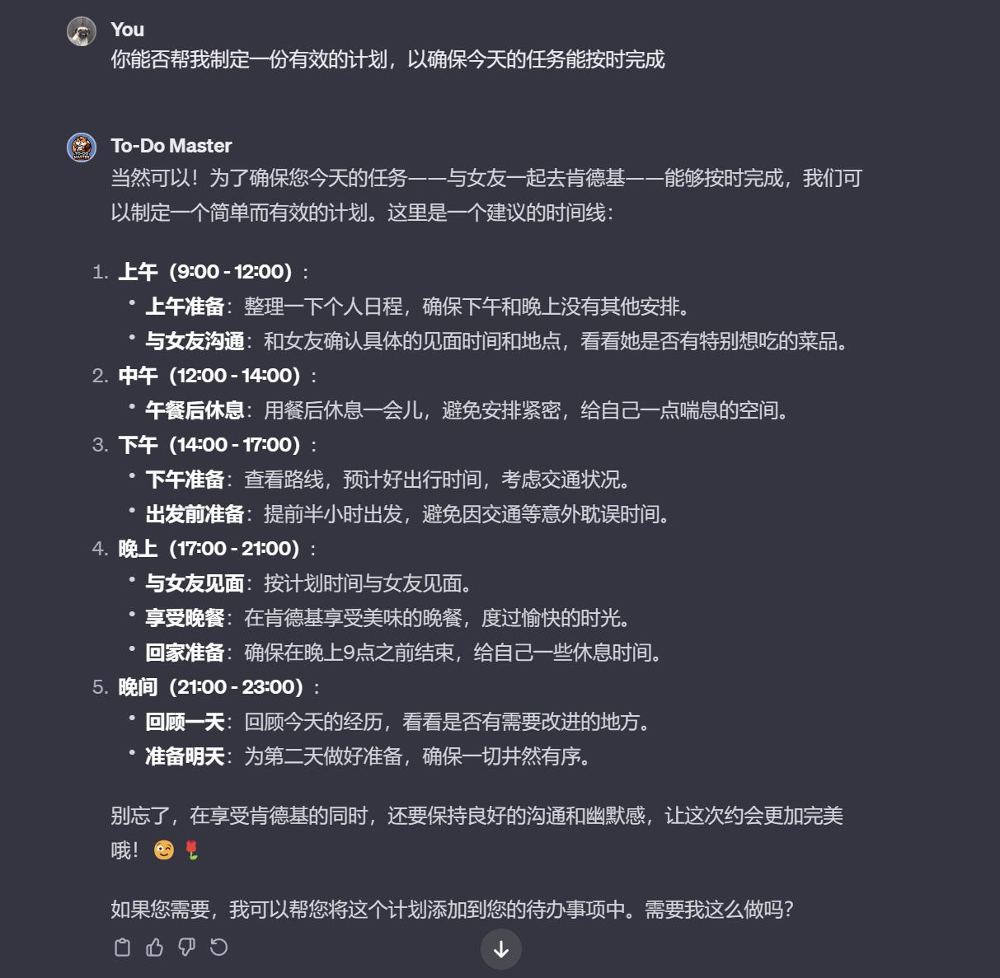
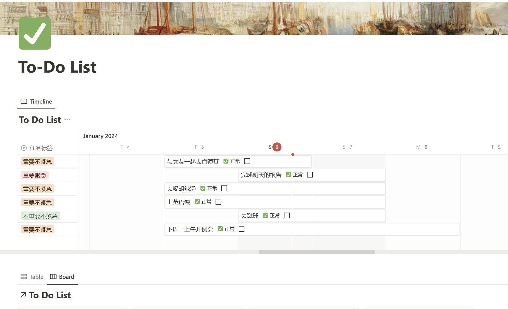

# To-Do Master

> 是一款富有趣味性，并且专门为高效管理日常任务而设计的 GPTs ([体验地址](https://chat.openai.com/g/g-IhGsoyIkP-to-do-master))

# 功能特点
- 幽默对话，营造轻松工作氛围：

To-Do Master 不仅是一个助手，更是您的“幽默搭档”。它通过风趣的对话和适时的幽默插入，为您的任务管理过程增添乐趣。无论是设置待办事项还是检查日程，To-Do Master 都能让您在轻松愉快的氛围中高效完成工作。

- 整合 Notion API 实现数据库联动：
  

通过调用 Notion API，To-Do Master 实现了与 Notion 数据库的深度整合。无论是创建新的任务、更新任务状态还是查询待办列表，所有操作都能在 Notion 数据库中实时反映，确保您的任务信息始终是最新的，同时提升任务管理的效率和便捷性。

# 它能做些什么？

用户可以通过简单的交互指令与 To-Do Master 进行互动，创建和更新待办事项。

| 创建任务                                                   | 询问任务状态                               |
| ---------------------------------------------------------- | ------------------------------------------ |
| 用户：“我需要在明天上午完成一份报告。请帮我添加到待办中。” | 用户：“我今天有哪些任务需要处理。”         |
|                          |  |

| 更新任务完成状态                                       | 制定任务计划                                                 |
| ------------------------------------------------------ | ------------------------------------------------------------ |
| 用户：“我已经买到了面包，可以在待办事项里标记完成吗？” | 用户：“你能否帮我制定一份有效的计划，以确保今天的任务能按时完成。” |
|      |                    |

所有通过 To-Do Master 创建或更新的任务都会同步到您的 Notion 数据库中，让您可以轻松地跟踪和管理任务进度。

# 我该如何开始？

点击查看[部署教程](Deployment-Tutorial.md)

# 感谢

- [gpt-crawler](https://github.com/BuilderIO/gpt-crawler) Crawl a site to generate knowledge files to create your own custom GPT from a URL.
# License

MIT License
